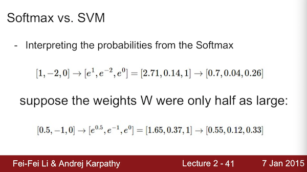
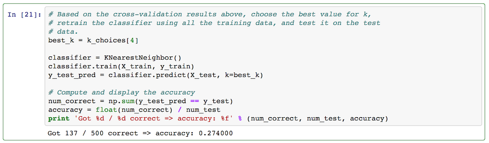
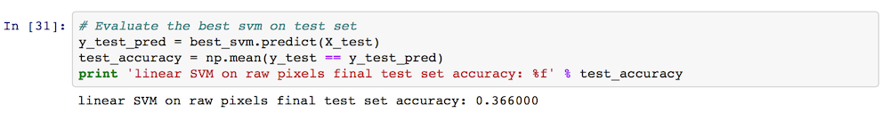
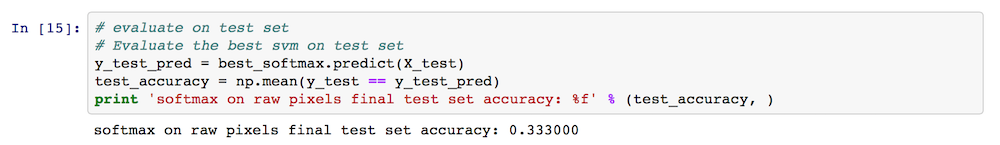

本文是stanford大学课程：[Convolutional Neural Networks for Visual Recognition](http://vision.stanford.edu/teaching/cs231n/) 的一些笔记与第一次作业。主要内容为简单（多类）分类器的实现：KNN, SVM, softmax。

softmax与SVM的一点区别，其中一张PPT说明：


分类器实现的训练步骤三步走：

- 计算 score matrix
- 基于 score matrix 与真实标签计算代价函数cost function/ loss function
- 由cost function对分类器参数求导，计算最优参数 （KNN不需要）


## KNN 分类器


KNN分类器封装为一个类，包括常规的函数`__init__`, `train`, `predict`以及一些别的重要函数。KNN不需要训练，因此`train`只是存下gallery数据和标签：

```
def train(self, X, y):
    """
    Train the classifier. For k-nearest neighbors this is just 
    memorizing the training data.
     
    Input:
    X - A num_train x dimension array where each row is a training point.
    y - A vector of length num_train, where y[i] is the label for X[i, :]
    """
    self.X_train = X
    self.y_train = y
```

对于KNN来说，预测分类，最主要的就是距离的定义与计算，得到一个距离矩阵或者称为得分矩阵score。然后根据score排序得到最相似的K个样本，采取某种策略由该K个样本的类别决定测试样本的标签。

```
def predict(self, X, k=1, num_loops=0):
    """
    Predict labels for test data using this classifier.

    Input:
    X - A num_test x dimension array where each row is a test point.
    k - The number of nearest neighbors that vote for predicted label
    num_loops - Determines which method to use to compute distances
                between training points and test points.

    Output:
    y - A vector of length num_test, where y[i] is the predicted label for the
        test point X[i, :].
    """
    if num_loops == 0:
      dists = self.compute_distances_no_loops(X)
    elif num_loops == 1:
      dists = self.compute_distances_one_loop(X)
    elif num_loops == 2:
      dists = self.compute_distances_two_loops(X)
    else:
      raise ValueError('Invalid value %d for num_loops' % num_loops)

    return self.predict_labels(dists, k=k)
```

其中`predict_labels`函数是由距离dists和k个近邻得到预测标签：

```
def predict_labels(self, dists, k=1):
    """
    Given a matrix of distances between test points and training points,
    predict a label for each test point.

    Input:
    dists - A num_test x num_train array where dists[i, j] gives the distance
            between the ith test point and the jth training point.

    Output:
    y - A vector of length num_test where y[i] is the predicted label for the
        ith test point.
    """
    num_test = dists.shape[0]
    y_pred = np.zeros(num_test)
    for i in xrange(num_test):
      # A list of length k storing the labels of the k nearest neighbors to
      # the ith test point.
      closest_y = []
      #########################################################################
      # TODO:                                                                 #
      # Use the distance matrix to find the k nearest neighbors of the ith    #
      # training point, and use self.y_train to find the labels of these      #
      # neighbors. Store these labels in closest_y.                           #
      # Hint: Look up the function numpy.argsort.                             #
      #########################################################################
      idx = np.argsort(dists[i, :])
      closest_y = list(self.y_train[idx[0:k]])
      #########################################################################
      # TODO:                                                                 #
      # Now that you have found the labels of the k nearest neighbors, you    #
      # need to find the most common label in the list closest_y of labels.   #
      # Store this label in y_pred[i]. Break ties by choosing the smaller     #
      # label.                                                                #
      #########################################################################
      labelCount = {}
      for j in xrange(k):
        labelCount[closest_y[j]] = labelCount.get(closest_y[j], 0) + 1
      sortedLabel = sorted(labelCount.iteritems(), key = lambda line:line[1], reverse = True)
      y_pred[i] = sortedLabel[0][0]
      #########################################################################
      #                           END OF YOUR CODE                            # 
      #########################################################################

    return y_pred
```

再来说用到的距离的计算，这里采用欧氏距离来衡量测试样本`X`和gallery数据`X_train`。注意到`X - An num_test x dimension array where each row is a test point.` 最终的dists应该是`num_test x num_train`的矩阵，变换可以用下面一句代码得到。至此，KNN分类器完成。

```
dists = np.sqrt(np.dot((X**2), np.ones((np.transpose(self.X_train)).shape))\
    + np.dot(np.ones(X.shape), np.transpose(self.X_train ** 2))\
    - 2 * np.dot(X, np.transpose(self.X_train)))
```


## linear classifier


这里只考虑softmax和linear svm两种分类器，统一封装为一个类。需要补全 `train` 与 `predict` 两部分。

```
import numpy as np
from cs231n.classifiers.linear_svm import *
from cs231n.classifiers.softmax import *

class LinearClassifier:

  def __init__(self):
    self.W = None

  def train(self, X, y, learning_rate=1e-3, reg=1e-5, num_iters=100,
            batch_size=200, verbose=False):
    """
    Train this linear classifier using stochastic gradient descent.

    Inputs:
    - X: D x N array of training data. Each training point is a D-dimensional
         column.
    - y: 1-dimensional array of length N with labels 0...K-1, for K classes.
    - learning_rate: (float) learning rate for optimization.
    - reg: (float) regularization strength.
    - num_iters: (integer) number of steps to take when optimizing
    - batch_size: (integer) number of training examples to use at each step.
    - verbose: (boolean) If true, print progress during optimization.

    Outputs:
    A list containing the value of the loss function at each training iteration.
    """
    dim, num_train = X.shape
    num_classes = np.max(y) + 1 # assume y takes values 0...K-1 where K is number of classes
    if self.W is None:
      # lazily initialize W
      self.W = np.random.randn(num_classes, dim) * 0.001

    # Run stochastic gradient descent to optimize W
    loss_history = []
    for it in xrange(num_iters):
      X_batch = None
      y_batch = None

      #########################################################################
      # TODO:                                                                 #
      # Sample batch_size elements from the training data and their           #
      # corresponding labels to use in this round of gradient descent.        #
      # Store the data in X_batch and their corresponding labels in           #
      # y_batch; after sampling X_batch should have shape (dim, batch_size)   #
      # and y_batch should have shape (batch_size,)                           #
      #                                                                       #
      # Hint: Use np.random.choice to generate indices. Sampling with         #
      # replacement is faster than sampling without replacement.              #
      #########################################################################
      sample_idx = np.random.choice(num_train, batch_size, replace = True)
      X_batch = X[:, sample_idx]
      y_batch = y[sample_idx]
      #########################################################################
      #                       END OF YOUR CODE                                #
      #########################################################################

      # evaluate loss and gradient
      loss, grad = self.loss(X_batch, y_batch, reg)
      loss_history.append(loss)

      # perform parameter update
      #########################################################################
      # TODO:                                                                 #
      # Update the weights using the gradient and the learning rate.          #
      #########################################################################
      self.W += -learning_rate*grad
      #########################################################################
      #                       END OF YOUR CODE                                #
      #########################################################################

      if verbose and it % 100 == 0:
        print 'iteration %d / %d: loss %f' % (it, num_iters, loss)

    return loss_history

  def predict(self, X):
    """
    Use the trained weights of this linear classifier to predict labels for
    data points.

    Inputs:
    - X: D x N array of training data. Each column is a D-dimensional point.

    Returns:
    - y_pred: Predicted labels for the data in X. y_pred is a 1-dimensional
      array of length N, and each element is an integer giving the predicted
      class.
    """
    y_pred = np.zeros(X.shape[1])
    ###########################################################################
    # TODO:                                                                   #
    # Implement this method. Store the predicted labels in y_pred.            #
    ###########################################################################
    y_pred = np.argmax(np.dot(self.W, X), axis = 0)
    ###########################################################################
    #                           END OF YOUR CODE                              #
    ###########################################################################
    return y_pred
  
  def loss(self, X_batch, y_batch, reg):
    """
    Compute the loss function and its derivative. 
    Subclasses will override this.

    Inputs:
    - X_batch: D x N array of data; each column is a data point.
    - y_batch: 1-dimensional array of length N with labels 0...K-1, for K classes.
    - reg: (float) regularization strength.

    Returns: A tuple containing:
    - loss as a single float
    - gradient with respect to self.W; an array of the same shape as W
    """
    pass


class LinearSVM(LinearClassifier):
  """ A subclass that uses the Multiclass SVM loss function """

  def loss(self, X_batch, y_batch, reg):
    return svm_loss_vectorized(self.W, X_batch, y_batch, reg)


class Softmax(LinearClassifier):
  """ A subclass that uses the Softmax + Cross-entropy loss function """

  def loss(self, X_batch, y_batch, reg):
    return softmax_loss_vectorized(self.W, X_batch, y_batch, reg)
```

这里面SVM和softmax是基于基类线性分类器的类，并分别定义了loss函数。
### SVM 的loss function 与 gradient ：
loss function:
$$L = \frac{1}{N} \sum_i \sum_ {y_i \ne j} \max( 0, \mathrm{f}(\mathrm{x} _ {i}, W) _ {j} - \mathrm{f}(\mathrm{x} _ {i}, W) _ {y_i} + 1 ) + \frac{\lambda}{2} \sum_k\sum_l W _ {k,l}^2 $$

gradient:
$$ \nabla _ {\mathrm{w} _ j} L = \frac{1}{N} \sum_i \mathrm{1} \\{\mathrm{w} _ {j} ^ {T} \mathrm{x} _ i - w _ {y_i}^T \mathrm{x} _ i + 1>0 \\}\mathrm{x}_i + \lambda \mathrm{w} _ j$$

根据公式很容易实现代码：

```
import numpy as np
from random import shuffle

def svm_loss_naive(W, X, y, reg):
  """
  Structured SVM loss function, naive implementation (with loops)
  Inputs:
  - W: C x D array of weights
  - X: D x N array of data. Data are D-dimensional columns
  - y: 1-dimensional array of length N with labels 0...K-1, for K classes
  - reg: (float) regularization strength
  Returns:
  a tuple of:
  - loss as single float
  - gradient with respect to weights W; an array of same shape as W
  """
  dW = np.zeros(W.shape) # initialize the gradient as zero

  # compute the loss and the gradient
  num_classes = W.shape[0]
  num_train = X.shape[1]
  loss = 0.0
  for i in xrange(num_train):
    scores = W.dot(X[:, i])
    correct_class_score = scores[y[i]]
    for j in xrange(num_classes):
      if j == y[i]:
        continue
      margin = scores[j] - correct_class_score + 1 # note delta = 1
      if margin > 0:
        loss += margin
        dW[j, :] += (X[:, i]).transpose()

  # Right now the loss is a sum over all training examples, but we want it
  # to be an average instead so we divide by num_train.
  loss /= num_train
  dW /= num_train

  # Add regularization to the loss.
  loss += 0.5 * reg * np.sum(W * W)
  dW += reg * W

  #############################################################################
  # TODO:                                                                     #
  # Compute the gradient of the loss function and store it dW.                #
  # Rather that first computing the loss and then computing the derivative,   #
  # it may be simpler to compute the derivative at the same time that the     #
  # loss is being computed. As a result you may need to modify some of the    #
  # code above to compute the gradient.                                       #
  #############################################################################

  return loss, dW


def svm_loss_vectorized(W, X, y, reg):
  """
  Structured SVM loss function, vectorized implementation.

  Inputs and outputs are the same as svm_loss_naive.
  """
  loss = 0.0
  dW = np.zeros(W.shape) # initialize the gradient as zero

  #############################################################################
  # TODO:                                                                     #
  # Implement a vectorized version of the structured SVM loss, storing the    #
  # result in loss.                                                           #
  #############################################################################
  num_train = y.shape[0]
  Y_hat = W.dot(X)
  err_dist = Y_hat - Y_hat[tuple([y, range(num_train)])] + 1
  err_dist[err_dist <= 0] = 0.0
  err_dist[tuple([y, range(num_train)])] = 0.0
  loss += np.sum(err_dist)/num_train
  loss += 0.5 * reg * np.sum(W * W)
  #############################################################################
  #                             END OF YOUR CODE                              #
  #############################################################################


  #############################################################################
  # TODO:                                                                     #
  # Implement a vectorized version of the gradient for the structured SVM     #
  # loss, storing the result in dW.                                           #
  #                                                                           #
  # Hint: Instead of computing the gradient from scratch, it may be easier    #
  # to reuse some of the intermediate values that you used to compute the     #
  # loss.                                                                     #
  #############################################################################
  err_dist[err_dist>0] = 1.0/num_train
  dW += err_dist.dot(X.transpose()) + reg * W
  #############################################################################
  #                             END OF YOUR CODE                              #
  #############################################################################

  return loss, dW
```


### softmax的loss function 与 gradient ：
loss function: 
$$ L = \frac {1}{N} \sum_i \sum_j \mathrm{1}\\{y_i=j \\}\cdot \log(\frac{e^{\mathrm{f} _ j}}{\sum_m e^{\mathrm{f} _ m}}) + \frac{\lambda}{2} \sum_k\sum_l W _ {k,l}^2$$

gradient: 
$$\nabla_{\mathrm{w} _ j} L = -\frac{1}{N} \sum_i \left[\mathrm{1} \\{y_i=j\\} - p(y_i=j|\mathrm{x} _ i;W)\right]\mathrm{x} _ i + \lambda \mathrm{w} _ j$$

其中 
$$ p(y_i=j | \mathrm{x} _ {i}; W) = \frac{e^{\mathrm{f} _ j}} {\sum_m e^{\mathrm{f} _ m}}$$


```
import numpy as np
from random import shuffle

def softmax_loss_naive(W, X, y, reg):
  """
  Softmax loss function, naive implementation (with loops)
  Inputs:
  - W: C x D array of weights
  - X: D x N array of data. Data are D-dimensional columns
  - y: 1-dimensional array of length N with labels 0...K-1, for K classes
  - reg: (float) regularization strength
  Returns:
  a tuple of:
  - loss as single float
  - gradient with respect to weights W, an array of same size as W
  """
  # Initialize the loss and gradient to zero.
  loss = 0.0
  dW = np.zeros_like(W)

  #############################################################################
  # TODO: Compute the softmax loss and its gradient using explicit loops.     #
  # Store the loss in loss and the gradient in dW. If you are not careful     #
  # here, it is easy to run into numeric instability. Don't forget the        #
  # regularization!                                                           #
  #############################################################################
  dim, num_data = X.shape
  num_class = W.shape[0]
  Y_hat = np.exp(np.dot(W, X))
  prob = Y_hat / np.sum(Y_hat, axis = 0)

  # C x N array, element(i,j)=1 if y[j]=i
  ground_truth = np.zeros_like(prob)
  ground_truth[tuple([y, range(len(y))])] = 1.0

  for i in xrange(num_data):
    for j in xrange(num_class):
      loss += -(ground_truth[j, i] * np.log(prob[j, i]))/num_data
      dW[j, :] += -(ground_truth[j, i] - prob[j, i])*(X[:,i]).transpose()/num_data
  loss += 0.5*reg*np.sum(np.sum(W**2, axis = 0)) # reg term
  dW += reg*W

  #############################################################################
  #                          END OF YOUR CODE                                 #
  #############################################################################

  return loss, dW


def softmax_loss_vectorized(W, X, y, reg):
  """
  Softmax loss function, vectorized version.

  Inputs and outputs are the same as softmax_loss_naive.
  """
  # Initialize the loss and gradient to zero.
  loss = 0.0
  dW = np.zeros_like(W)

  #############################################################################
  # TODO: Compute the softmax loss and its gradient using no explicit loops.  #
  # Store the loss in loss and the gradient in dW. If you are not careful     #
  # here, it is easy to run into numeric instability. Don't forget the        #
  # regularization!                                                           #
  #############################################################################
  dim, num_data = X.shape
  Y_hat = np.exp(np.dot(W, X))
  prob = Y_hat / np.sum(Y_hat, axis = 0)#probabilities

  # C x N array, element(i,j)=1 if y[j]=i
  ground_truth = np.zeros_like(prob)
  ground_truth[tuple([y, range(len(y))])] = 1.0
  
  loss = -np.sum(ground_truth*np.log(prob)) / num_data + 0.5*reg*np.sum(W*W)
  dW = (-np.dot(ground_truth - prob, X.transpose()))/num_data + reg*W
  #############################################################################
  #                          END OF YOUR CODE                                 #
  #############################################################################

  return loss, dW
```

在相应ipython notebook上运行，测试三种分类器效果：
KNN的测试结果（K=10）：


SVM测试结果：


Softmax测试结果：


