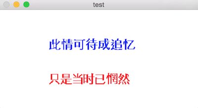

图像处理过程中为了显示结果，可能需要在图像上显示文字。
基于C/C++语言的可以使用opencv的`putText`函数完成这一功能。opencv自带函数 `putText` 可以实现往图像上写入文本字符串这一功能。这可以将检测或者识别结果方便地在图像或者视频上标出来。
基于python语言的可以使用opencv的Python `cv2.putText`函数以及PIL package中的`imageDraw`模块。

- C++中opencv包渲染文字的函数说明：

```
C++: void putText(Mat& img, const string& text, Point org, int fontFace, double fontScale, Scalar color, int thickness=1, int lineType=8, bool bottomLeftOrigin=false )
```
- python中opencv包渲染文字的函数说明：

```
Python: cv2.putText(img, text, org, fontFace, fontScale, color[, thickness[, lineType[, bottomLeftOrigin]]]) → None
```
`putText` 将以位置`org`为左下角，在图像`img`上渲染字符串`text`。函数可以指定字体类型、字体大小，字体颜色，粗细，线条类型等参数。

- python中PIL包渲染文字的函数说明：

```
PIL.ImageDraw.Draw.text(xy, text, fill=None, font=None, anchor=None)
PIL.ImageDraw.Draw.multiline_text(xy, text, fill=None, font=None, anchor=None, spacing=0, align="left")
PIL.ImageDraw.Draw.textsize(text, font=None)
PIL.ImageDraw.Draw.multiline_textsize(text, font=None, spacing=0)
```
`PIL.ImageDraw.Draw.text()`中的参数`xy`即类似于`putText`中的`org`，用于指定文字位置。不过需要注意的是，`xy`指定的是左上角坐标，而 `org`指定的是左下角坐标。

opencv的`putText`目前支持的字体能够表示英文字母和数字，并不能够表示中文，中文字符串会变成一串问号。PIL可以直接指定字体类型显示中文。

# 1. opencv与C++环境下方法

网上有人已经基于freetype写了一个支持中文的putText，特此记录一下使用方法。

1. 首先，需要安装[freetype](http://www.freetype.org/index.html)。

>FreeType is a freely available software library to render fonts.

我下载的是Freetype 2.6。然后将压缩包置于某一路径（比如~/src）下，解压缩，命令行进入到该解压缩后的文件路径下。

```
cd ~/src/freetype-2.6
./configure
make
make install
```
这就安装好了，freetype的include和lib文件夹分别位于

```
/usr/local/include/freetype2
/usr/local/lib
```
在使用freetype的时候，需要添加这两个路径添加。

2. 然后，下载代码[i18nText](https://github.com/zhh-cui/i18nText)。该代码主要内容包含一个`i18nText.h`头文件和`i18nText.cpp`，这两个文件实现了一个新的往图像上渲染文字函数`i18nText.putText()`。


3. 最后，开始基于以上基础在Xcode project中往图像上渲染文字。
project的 Build Settings添加以下：
	- header search path : /usr/local/include/freetype2
	- lib search path : /usr/local/lib
	- project名字上右键选择add files to 'xxx'，添加/usr/local/lib/libfreetype.6.dylib
	
然后，测试样例如下：

```
    cv::Mat test(200, 400, CV_8UC3, CV_RGB(255, 255, 255));
    cv::namedWindow("test", CV_WINDOW_NORMAL);
    i18nText i18n;
    FT_Error success = i18n.setFont("/System/Library/Fonts/STHeiti Light.ttc");
        
    if (success) {
        std::cout << "Load fonts successfully." << std::endl;
        
        const wchar_t *msg1 = L"此情可待成追忆";
        int num = i18n.putText(test, msg1, cv::Point(100, 80), CV_RGB(0, 0, 255));
        
        
        const wchar_t *msg2 = L"只是当时已惘然";
        num = i18n.putText(test, msg2, cv::Point(100, 150), CV_RGB(255, 0, 0));
        
    }
    
    cv::imshow("test", test);
    cv::waitKey(0);

```

其中，首先需要创建一个实例`i18nText`，然后调用`i18nText.setFont()`设置字体，接着就可以类似于opencv那样调用`i18nText.putText()`对图像进行文字渲染了。运行后显示（截图并下采样了的，显示得有点模糊诶）：



#2. python中PIL方法
首先得需要安装PIL package。通过pip可以轻松搞定，不过名字并不叫PIL，而是pillow

```
sudo pip install pillow
```
最后，通过指定字体类型，位置等参数就可以完成文字渲染。下面是具体的测试代码

```
# -*- coding: utf-8 -*-
from PIL import Image,ImageDraw,ImageFont
import sys

img = Image.new('RGB', (400, 200), (255, 255, 255))

font = ImageFont.truetype('/System/Library/Fonts/STHeiti Light.ttc', 24)

draw = ImageDraw.Draw(img)

words_1 = u'此情可待成追忆'
draw.text((100, 80), words_1, (0, 0, 255), font=font)

words_2 = unicode('只是当时已惘然', 'utf-8')
draw.text((100, 150), words_2, (255, 0, 0), font=font) 

#img.show()
img.save('chn_text_python.png')
```
运行显示结果（没有边框的样子好怪。。。）:


对比一下两张显示结果，同样的参数，PIL中的要靠上一点，这也就是坐标位置指定的是左上角而非左下角的缘故。

需要注意的是，新建一张特定大小的纯白图像，在opencv和PIL中指定参数时候顺序并不一样。一张高200像素，宽400像素的图像，在opencv中是(200, 400)，对应于PIL中的(400, 200)。不过在putText和text方法里倒是坐标一致了，都是(横向距离，竖向距离)，即与PIL中相一致。

#3. 总结
- 在python中，只要安装调用PIL的ImageDraw模块即可，简单易操作。不过估计也是要依赖于freetype，这个暂时不太清楚。
- 在C++中，需要首先安装freetype，并进行相应设置（include，lib/dylib）。最后在你的工程里包含进i18nText的两个简单文件就可以通过`i18nText.putText()`来进行中文渲染了。好像是略复杂，没办法啦。

