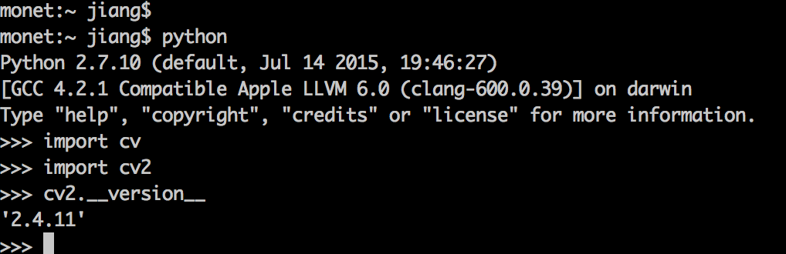
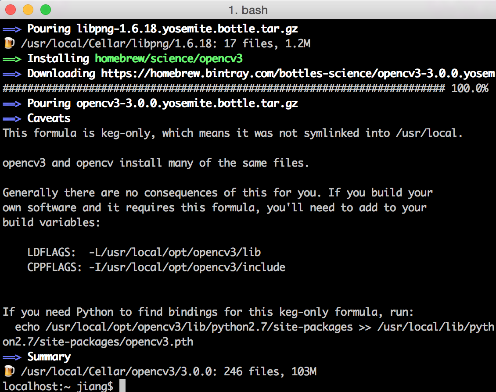
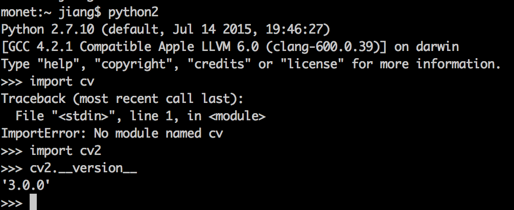

##opencv2的安装及其python binding

使用homebrew安装将极为简单安全，而使用cmake手动配置复杂很多。假设已有homebew，那么

1. 首先安装opencv2

```
brew tap homebrew/science
brew install opencv
```
opencv将被安装于`/usr/local/Cellar/opencv/2.4.11_1/`

2. 进入到Python目录下，比如

```
cd /Library/Python/2.7/site-packages/
```
创建软链接

```
ln -s /usr/local/Cellar/opencv/2.4.11_1/lib/python2.7/site-packages/cv.py cv.py
ln -s /usr/local/Cellar/opencv/2.4.11_1/lib/python2.7/site-packages/cv2.so cv2.so
```

3. 测试python的opencv是否安装成功及其版本

只要在python中看是否import成功

```
import cv
import cv2
cv2.__version__
```



##opencv3的安装及其python binding
由于opencv3比opencv2新添了很多有趣有用的功能，因此可以再安装一个opencv3，并且希望两个版本共存，并且都可以binding到python。为了后续Python调用分得清楚且方便，于是安装[anaconda](https://www.continuum.io/downloads)作为新的python入口。

>
Anaconda is a completely free Python distribution (including for commercial use and redistribution). It includes more than 300 of the most popular Python packages for science, math, engineering, and data analysis.


- 用brew方法进行安装opencv3
brew安装opencv3相对要简单很多，一句命令就搞定了。但是好像这么安装后看不到大部分源码。所以想要阅读或使用修改opencv3的某些代码，还是去github上下载一份看，比如opencv3的[opencv_contrib](https://github.com/Itseez/opencv_contrib)。

```
brew install opencv3 —with-contrib
```

—with-contrib表示安装opencv3 contrib repo，contrib里有很多新添加的模块，opencv2里面的SIFT等特征也被挪到了这里面。

安装后opencv3位于目录：
`/usr/local/Cellar/opencv3/3.0.0`
。而之前安装的opencv2.4目录在：
`/usr/local/Cellar/opencv/2.4.11_1`

上述安装过程最后会给出一些提示信息


brew为了不混淆opencv2和opencv3，并没把opencv3软链接到/usr/local/。所以，系统默认的路径下，/usr/local/include 以及 /usr/local/lib下的文件其实还是被链接到opencv2的文件下的，因此如果想要用到opencv3这个库，必须明确指定路径:

```
/usr/local/opt/opencv3/include
/usr/local/opt/opencv3/lib
```
其实这两个也是被链接到/usr/local/Cellar/opencv3/3.0.0/include

同时，很多别的包的lib和include也都放置在/usr/local/include下，比如boost。

- opencv3的python binding

上述安装过程提示，如果想要把opencv和python绑定，需要执行：

```
echo /usr/local/opt/opencv3/lib/python2.7/site-packages >> /usr/local/lib/python2.7/site-packages/opencv3.pth
```
这句命令意在将opencv3的部分内容重定向到特定路径下的opencv3.pth，相当于指定opencv3所在真实路径。而我想要重定向到anaconda下（知道自己的anaconda路径），于是执行：

```
echo /usr/local/opt/opencv3/lib/python2.7/site-packages >> ~/anaconda/lib/python2.7/site-packages/opencv3.pth
```
其实，感觉这部分操作，类似于opencv2安装过程中的创建软链接，将cv2.so链接到python packages路径下。

- 测试python的opencv是否安装成功及其版本


```
import cv
import cv2
cv2.__version__
```


结果显示，cv没安装成功，cv2安装好了，版本为3.0.0。考虑到也没用到过cv，所以暂时不管了。 


## Xcode中配置opencv3

- 创建一个新工程project
- 点击build settings -> All
	- 搜索 header search paths，添加`/usr/local/opt/opencv3/include`以及其他必备include内容（比如系统默认/usr/local/include）
	- 搜索 library search paths，添加`/usr/local/opt/opencv3/lib` 
- 右键project名，选择add files to “project_name”，一个新的窗口会弹出，点击`/`即可跳出路径输入窗口，键入`/usr/local/opt/opencv3/lib`，选择必要的动态链接库文件，比如```
          libopencv_core.3.0.0.dylib
          libopencv_highgui.3.0.0.dylib```
- 链接设置：找到linking下地other linker flags，双击并单击+按钮，写入所需要的

```
    -lopencv_calib3d -lopencv_core -lopencv_features2d -lopencv_flann -lopencv_highgui -lopencv_imgcodecs -lopencv_imgproc -lopencv_ml -lopencv_objdetect -lopencv_photo -lopencv_shape -lopencv_stitching -lopencv_superres -lopencv_ts -lopencv_video -lopencv_videoio -lopencv_videostab -lopencv_text
```


## 命令行使用opencv

使用命令行运行包含opencv的cpp文件时，需要指定一些参数(include/lib/dylib等)。如果调用的东西不怎么复杂的时候，可以直接全部手动输入哈，比如：

```
g++ -I/usr/local/Cellar/opencv3/3.0.0/include/opencv -I/usr/local/Cellar/opencv3/3.0.0/include -L/usr/local/Cellar/opencv3/3.0.0/lib  -lopencv_face  -lopencv_objdetect  -lopencv_highgui  -lopencv_imgcodecs -lopencv_imgproc -lopencv_core  test.cpp -o test

```

或者使用pkg-config简化操作(安装可以用brew install pkg-config)。pkg-config是一个在源代码编译时查询已安装的库的使用接口的计算机工具软件。首先`pkg-config —-cflags —-libs opencv`或者`pkg-config —-cflags —-libs opencv3`可以自动调出opencv中原先配置的链接库、头文件等。可能一些情况下，上述命令会找不到opencv。解决办法就是先找到pkg-config的路径。去```
/usr/local/lib/pkg-config
```
路径下看看是否有opencv.pc或者opencv3.pc。
如果用brew安装opencv3，那么opencv3对应的opencv.pc在brew安装路径下的lib下面，可能需要配置一下。配置方法：在~/.bash_profile里面写上两行：
export PKG_CONFIG_PATH=/usr/local/lib/pkgconfig
export PKG_CONFIG_PATH=/usr/local/opt/opencv3/lib/pkg-config/

```
-I/usr/local/Cellar/opencv3/3.0.0/include/opencv -I/usr/local/Cellar/opencv3/3.0.0/include -L/usr/local/Cellar/opencv3/3.0.0/lib -lopencv_stitching -lopencv_superres -lopencv_videostab -lopencv_adas -lopencv_bgsegm -lopencv_bioinspired -lopencv_ccalib -lopencv_datasets -lopencv_face -lopencv_latentsvm -lopencv_objdetect -lopencv_line_descriptor -lopencv_optflow -lopencv_reg -lopencv_rgbd -lopencv_saliency -lopencv_surface_matching -lopencv_text -lopencv_tracking -lopencv_xfeatures2d -lopencv_calib3d -lopencv_features2d -lopencv_shape -lopencv_video -lopencv_ml -lopencv_flann -lopencv_ximgproc -lopencv_xobjdetect -lopencv_xphoto -lopencv_highgui -lopencv_videoio -lopencv_imgcodecs -lopencv_photo -lopencv_imgproc -lopencv_core -lopencv_hal
```
所以只需要简单一行即可顺利生成可执行文件：

```
g++ `pkg-config --cflags --libs opencv` test.cpp -o test
```
然后运行test可执行文件即可：`./test`。


比如，test.cpp里面是如下人脸检测代码：

```
#include "opencv2/objdetect/objdetect.hpp"
#include "opencv2/highgui/highgui.hpp"
#include "opencv2/imgproc/imgproc.hpp"
    
#include <iostream>
#include <stdio.h>
    
using namespace std;
using namespace cv;

int main( )
{
    Mat image;
    image = imread("/Users/jiang/Desktop/test.jpg");
    namedWindow( "window", 1 );
    imshow( "window", image );
    //cvtColor(image, image, COLOR_BGR2GRAY);
    
    // Load Face cascade (.xml file)
    CascadeClassifier face_cascade;
    face_cascade.load( "/Users/jiang/Desktop/haarcascade_frontalface_alt2.xml" );
    
    // Detect faces
    std::vector<Rect> faces;
    face_cascade.detectMultiScale( image, faces, 1.1, 2, 0|CV_HAAR_SCALE_IMAGE, Size(30, 30) );
    
    // Draw circles on the detected faces
    for( int i = 0; i < faces.size(); i++ )
    {
        Point center( faces[i].x + faces[i].width*0.5, faces[i].y + faces[i].height*0.5 );
        ellipse( image, center, Size( faces[i].width*0.5, faces[i].height*0.5), 0, 0, 360, Scalar( 255, 0, 255 ), 4, 8, 0 );
    }
    
    imshow( "Detected Face", image );
    
    waitKey(0);                   
    return 0;
}
```

上述代码，需要从opencv路径那里拷贝`haarcascade_frontalface_alt2.xml`到当前路径下，检测结果如图。哈哈拿靖王殿下试试手吧。

